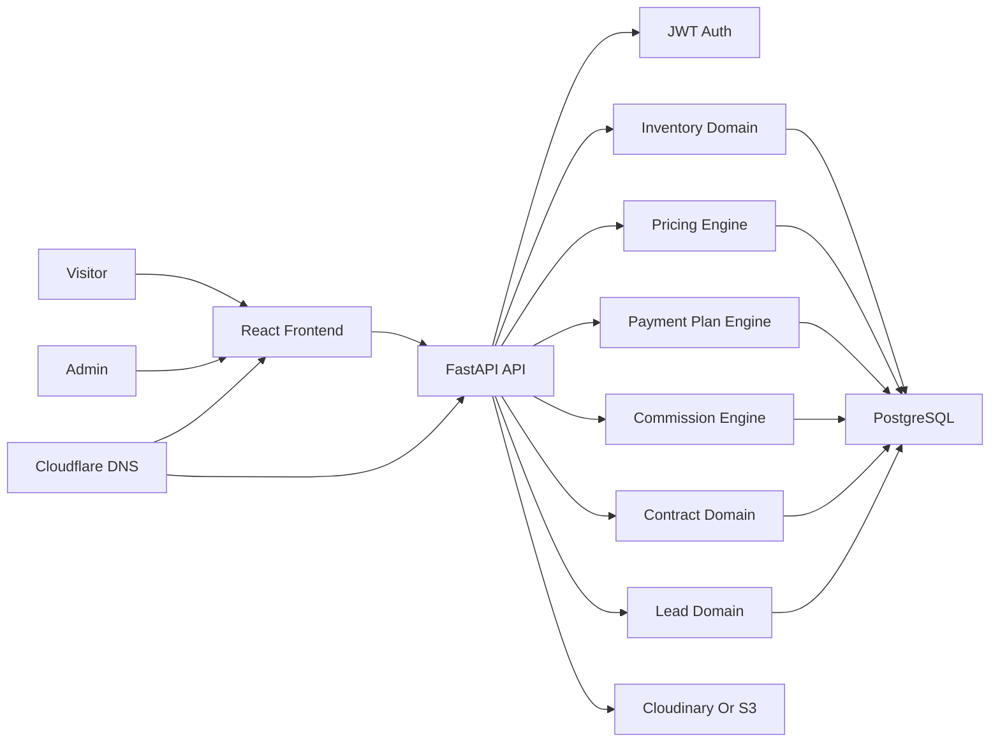

# Belay Properties Implementation Plan

## Purpose

This document converts the approved Belay Properties architecture into an execution plan that can be followed step by step. It does not replace the original Cursor plan; it is a workspace Markdown copy tailored for implementation, manual testing, GitHub, AWS EC2 deployment, and Cloudflare DNS.

## Project Summary

Belay Properties is a modern Ethiopian real estate platform for aggregating and selling verified properties from companies such as Ayat Real Estate. The platform must support real business workflows, not only simple listings.

The MVP must support:

- Public real estate discovery.
- Mobile-first property listings and detail pages.
- WhatsApp and lead-form contact.
- Admin login.
- Company, project, unit, listing, image, lead, pricing, payment-plan, commission, contract, and document management.
- Dynamic company-specific pricing, starting with Ayat Real Estate, based on company, project, floor band, unit type, payment plan, date, discounts, commissions, and contract rules.
- Historical pricing versions and quote snapshots.
- AWS EC2 deployment with Docker.
- GitHub source control.
- Cloudflare DNS using a Belay Sirak subdomain.

## Important Business Rules From Ayat Documents

The attached Ayat Share Company pricing photos were analyzed with Amharic and English OCR. OCR is good enough for architecture decisions, but exact numeric price rows must be manually verified before production data entry.

Verified business patterns:

- Pricing documents have reference numbers and validity windows.
- Apartment prices can change over time, including periodic changes.
- Pricing varies by project/location, floor band, unit type, construction state, and finish/category.
- Some price tables are per square meter and include VAT.
- Residential and commercial units can have different payment eligibility.
- Shops may be excluded from long-term `60/40` payment structures.
- Buyers with signed contracts should be protected from later price increases.
- Upfront-payment discount tiers exist.
- Group-buyer discount tiers exist.
- Sales channels can include corporate, branch/office, agent, and freelance sales.

## Multi-Company Requirement

Ayat Real Estate is the first real estate company to support, but the backend must be built as a multi-company platform from the beginning. Future companies should be added through admin configuration and data entry, not by changing backend code.

The system must support:

- Multiple real estate companies under Belay Properties.
- Company-specific projects, blocks, unit types, units, listings, and documents.
- Company-specific pricing versions and price table formats.
- Company-specific payment plans and eligibility rules.
- Company-specific commission schemes and agent contracts.
- Company-specific lead reporting.
- Public listings that clearly show the source company while keeping Belay Properties as the verified sales/contact layer.

Backend design rule:

Every business rule that can vary between companies must be stored in the database and resolved by `company_id`. Ayat-specific rules should be entered as data for Ayat, not hardcoded into the pricing engine.

Example future onboarding flow:

1. Admin creates a new real estate company.
2. Admin uploads that company's pricing and commission documents.
3. Admin creates projects, blocks, unit types, and units for that company.
4. Admin configures pricing versions, payment plans, discount rules, and commission rules.
5. Admin publishes public listings under Belay Properties.
6. Visitors can browse those listings together with Ayat listings.

## Recommended Domain And Hosting Names

Your existing Cloudflare domain was described as `www.belay-sirak`. In Cloudflare, the real DNS zone usually needs a full domain such as `belay-sirak.com`, `belay-sirak.et`, or another registered root domain.

Recommended production naming:

- Public site: `realtor.belay-sirak.<tld>` or `properties.belay-sirak.<tld>`.
- API: `api.realtor.belay-sirak.<tld>`.
- Admin dashboard: either `/admin` on the public site or `admin.realtor.belay-sirak.<tld>`.
- Existing portfolio: keep `www.belay-sirak.<tld>` unchanged.

Recommended MVP choice:

- Use `realtor.belay-sirak.<tld>` for the frontend.
- Use `api.realtor.belay-sirak.<tld>` for the backend.
- Use `realtor.belay-sirak.<tld>/admin` for the admin dashboard.

Why:

- Keeps the portfolio separate.
- Makes DNS and SSL clean.
- Allows the real estate platform to grow without interfering with the portfolio site.

## Target Tech Stack

### Frontend

- React.
- TypeScript.
- Vite.
- Tailwind CSS.
- React Router.
- Axios.
- TanStack Query.

### Backend

- Python.
- FastAPI.
- SQLAlchemy.
- PostgreSQL.
- Alembic migrations.
- JWT authentication.
- Docker.

### Storage

- Cloudinary for MVP image uploads, or S3-compatible storage later.
- Document storage for pricing tables, contracts, and source files.

### Deployment

- GitHub for repository hosting.
- AWS EC2 for the backend and database in MVP.
- Docker Compose on EC2.
- Cloudflare for DNS, proxy, and SSL.
- Optional Vercel for frontend, but EC2 can host everything if you prefer a single server.

## System Architecture



## Backend Domain Structure

Recommended backend modules:

```text
backend/app/
  api/v1/
  core/
  db/
  domains/
    identity/
    companies/
    inventory/
    pricing/
    payment_plans/
    commissions/
    contracts/
    leads/
    documents/
    audit/
  shared/
    money/
    pagination/
    permissions/
    errors/
    storage/
```

Why:

- Pricing logic stays separate from property listing logic.
- Commission rules can change without breaking inventory.
- Contracts can lock quote snapshots independently from live pricing.
- Each domain can later become easier to test and scale.

## Core Database Domains

### Identity

- `users`
- `roles`
- `user_roles`

### Company And Source Data

- `companies`
- `company_contacts`
- `sales_channels`

### Inventory

- `projects`
- `blocks`
- `unit_types`
- `property_units`
- `unit_status_history`

### Public Marketing

- `property_listings`
- `property_images`

### Pricing

- `pricing_documents`
- `pricing_versions`
- `price_table_rows`
- `discount_rules`
- `unit_price_quotes`
- `price_history_events`

### Payment Plans

- `payment_plans`
- `payment_plan_steps`
- `installment_schedules`
- `installment_schedule_items`

### Commissions

- `commission_schemes`
- `commission_rules`
- `agent_contracts`
- `commission_estimates`

### Leads And Contracts

- `leads`
- `lead_quotes`
- `reservations`
- `sales_contracts`

### Audit And Analytics

- `audit_log`
- `property_view_events`
- `lead_events`

## Pricing Engine Rules

The backend must never rely on one static `price` field as the source of truth.

The pricing engine should:

- Resolve the active pricing version by company, project, and date.
- Match the unit by project, block, floor band, unit type, finish type, and construction state.
- Calculate base price from `area_sqm * price_per_sqm`, unless fixed price is configured.
- Apply discount rules separately from base price.
- Calculate down payment from the selected payment plan.
- Generate installment steps.
- Calculate commission using the active commission scheme.
- Store a quote snapshot so the result is auditable.

## Payment Plan Rules

The system should support:

- Full payment.
- Upfront-heavy plans.
- `60/40` plans.
- Construction milestone plans.
- Commercial-unit restrictions.
- Residential-unit restrictions.

Important rule:

Once a contract is signed, the contract must use the saved quote and payment schedule snapshot. Later pricing or payment-plan changes must not change signed contracts.

## Commission Rules

Commission can vary by:

- Company.
- Sales channel.
- Agent contract.
- Payment plan.
- Upfront payment percentage.
- Unit category.
- Effective date.

Commission must be versioned and auditable because Belay Properties is acting as a verified sales agent.

## Implementation Phases With Manual Checklists

The following phases are ordered for a clear dependency chain: **database and APIs first (Phases 1–9), then the public site and admin dashboard (Phases 10–11)**. That keeps business rules in the backend before wiring the UI.

### Testing strategy: API first, then UI-driven acceptance

- **While backend phases are in progress (roughly Phases 2–9):** use FastAPI `/docs`, `curl`, the database, and automated tests (`pytest`) to prove each phase’s checklist. That stays the fastest feedback loop during API work.
- **Primary manual testing for real users:** once the **React UI exists**, repeat the same scenarios **in the browser** (public site and admin). Swagger alone is not enough to validate layout, mobile behavior, forms, and end-to-end flows.
- **Recommended overlap (so you are not blocked on Swagger for months):** as soon as **Phase 5 (inventory and listing API)** is usable, start **thin vertical slices of Phase 10 (public)** and **Phase 11 (admin)**—for example admin login, company/project/unit listing forms, and public listing + detail pages wired to the API. Then extend the UI **alongside** Phases 6–9 so new APIs get a minimal screen early and full acceptance stays UI-driven where it matters.

After each phase, run that phase’s **API-level** checklist before moving on. When the UI covers a feature, add the same scenario to your **browser** checklist so both layers stay aligned.

### Backend phases 1–5: implementation vs manual checks

For **Phases 1 through 5**, the **repository already contains** the implementation described in each phase’s build scope (structure, FastAPI foundation, models and migrations, auth, inventory and public listing APIs, plus automated tests where added). **You should still run every unchecked item** under “Checklist before continuing (manual verification)” in your own environment (Docker, browser, DB tools) before treating the phase as fully signed off.

## Phase 1: Repository And Project Setup

### Build Scope

- Create repository structure under `/home/abu/realstate`.
- Add `frontend/`.
- Add `backend/`.
- Add `docs/`.
- Add root `README.md`.
- Add `.gitignore`.
- Initialize Git repository.
- Prepare GitHub remote later when you provide the repository URL.

### Expected Files

```text
realstate/
  frontend/
  backend/
  docs/
  README.md
  .gitignore
```

### Use Cases To Test Yourself

- You can open the project folder and clearly see frontend, backend, and docs.
- You can run `git status` and see the project is a Git repository.
- You can push to GitHub after a remote is configured.

### Implementation status (repository)

- [x] Repository layout with `frontend/`, `backend/`, `docs/`, root `README.md`, and `.gitignore`.
- [x] Git repository initialized locally (continue using your chosen GitHub remote).

### Checklist before continuing (manual verification)

Tick only after **you** confirm in your environment.

- [ ] The project folder is organized clearly.
- [ ] The original plan file outside the workspace was not edited.
- [ ] Git is initialized locally.
- [ ] `.gitignore` excludes `.env`, virtual environments, `node_modules`, build outputs, and Python cache files.
- [ ] You have decided whether to create a new GitHub repository manually or give the GitHub repo URL for remote setup.

## Phase 2: Backend Foundation

### Build Scope

- Create FastAPI app.
- Configure app settings.
- Configure PostgreSQL database connection.
- Configure SQLAlchemy.
- Configure Alembic.
- Add health check endpoint.
- Add shared error response format.
- Add CORS configuration.

### Use Cases To Test Yourself

- Open `/health` and confirm the API responds.
- Open `/docs` and confirm FastAPI Swagger docs load.
- Shut down the database and confirm the API gives a clear database error where expected.

### Implementation status (repository)

- [x] FastAPI app, settings, PostgreSQL session, Alembic wiring, `/health` and `/api/v1/health` (+ DB health), shared JSON error shape, CORS (comma-separated origins supported).

### Checklist before continuing (manual verification)

- [ ] FastAPI starts locally.
- [ ] Swagger docs are accessible.
- [ ] Environment variables are loaded from backend config.
- [ ] Database URL is not hardcoded.
- [ ] Alembic is ready for migrations.

## Phase 3: Database Models And Migrations

### Build Scope

Create SQLAlchemy models and Alembic migrations for:

- Users and roles.
- Companies.
- Projects.
- Blocks.
- Unit types.
- Property units.
- Unit status history.
- Public listings.
- Images.
- Pricing documents.
- Pricing versions.
- Price table rows.
- Discount rules.
- Payment plans.
- Payment plan steps.
- Commission schemes.
- Commission rules.
- Agent contracts.
- Quotes.
- Leads.
- Reservations.
- Sales contracts.
- Audit logs.

### Use Cases To Test Yourself

- Run migrations against a fresh PostgreSQL database.
- Inspect tables with a database client.
- Insert one company, one project, one block, and one unit.
- Confirm a public listing can be linked to a unit.

### Implementation status (repository)

- [x] SQLAlchemy models and initial Alembic migration for the domains listed in build scope (identity, company, inventory, pricing, payment, commission, leads/contracts, analytics, audit).
- [x] Follow-up migration seeding default `admin` and `agent` roles.

### Checklist before continuing (manual verification)

- [ ] Migrations run successfully from zero.
- [ ] All important tables exist.
- [ ] UUID primary keys are used.
- [ ] Money and percentages use decimal/numeric types.
- [ ] Published pricing can be versioned by effective date.
- [ ] Quote and contract tables can store snapshots.

## Phase 4: Authentication And Permissions

### Build Scope

- Admin login.
- Password hashing.
- JWT access token.
- Current-user endpoint.
- Protected admin routes.
- Role-ready permission structure.

### Use Cases To Test Yourself

- Try logging in with wrong credentials.
- Try logging in with correct credentials.
- Call an admin endpoint without a token and confirm it fails.
- Call an admin endpoint with a token and confirm it works.
- After the **admin UI login** exists (Phase 11), repeat wrong password, successful login, and “protected page without session” entirely in the browser, not only in `/docs`.

### Implementation status (repository)

- [x] Password hashing (bcrypt), JWT access token, `POST /api/v1/auth/login`, `GET /api/v1/auth/me`, admin-only example route, `require_roles(...)` dependency for future admin APIs, automated auth tests.

### Checklist before continuing (manual verification)

- [ ] Passwords are hashed.
- [ ] Admin token works.
- [ ] Protected routes reject unauthenticated requests.
- [ ] Public endpoints do not require login.
- [ ] Pricing publish actions are designed for admin-only permissions.

## Phase 5: Inventory And Listing API

### Build Scope

- Company CRUD.
- Project CRUD.
- Block CRUD.
- Unit type CRUD.
- Property unit CRUD.
- Unit status updates.
- Public listing CRUD.
- Public property listing endpoint.
- Public property detail endpoint.
- Basic filtering by city, area, bedrooms, unit type, and availability.

### Use Cases To Test Yourself

- Create Ayat Real Estate as a company.
- Create one project such as Ayat or CMC.
- Create a block.
- Create apartment unit types.
- Create units on different floor numbers.
- Publish a listing for one available unit.
- Mark one unit reserved or sold and confirm availability changes.
- When **Phase 10/11 UI** exposes these flows, run the same scenarios in the UI (create/edit in admin, browse and filter on the public site) so acceptance matches how operators and visitors will use the product.

### Implementation status (repository)

- [x] Admin CRUD under `/api/v1/admin` for companies, projects, blocks, unit types, property units (including `POST .../units/{id}/status` with history), and listings.
- [x] Public read APIs under `/api/v1/public/listings` (list with filters + detail by slug); list/detail only expose **public, available** inventory as specified in code.
- [x] Automated API test covering admin chain and public visibility when a unit becomes sold.

### Checklist before continuing (manual verification)

- [ ] Companies can be created and edited.
- [ ] Projects and blocks can be created.
- [ ] Units can be created with floor, area, status, and type.
- [ ] Public listings can be attached to units.
- [ ] Sold or unavailable units do not appear as available.
- [ ] Filters return expected results.

## Phase 6: Pricing Engine

### Implementation status (repository)

- [x] Admin APIs: pricing documents, pricing versions (draft/publish), price rows, discount rules.
- [x] `POST /api/v1/admin/pricing/calculate` with optional `persist_quote`; `GET /api/v1/admin/pricing/quotes`.
- [x] Pricing engine: active published version by date, row matching (project/block/floor band/unit type), stacked discounts, quote snapshot JSON.
- [x] `GET /api/v1/public/listings/{slug}/price-preview` for public indicative price.
- [x] Demo pricing seeded with `seed_demo_data` (Ayat published version + rows).
- [ ] File upload / OCR pipeline for pricing documents (metadata + `storage_url` only for now).

### Build Scope

- Upload pricing documents.
- Store OCR or extracted text fields.
- Create draft pricing versions.
- Add price table rows.
- Publish pricing versions.
- Calculate unit price from active pricing version.
- Apply discount rules.
- Store quote snapshots.
- Expose pricing calculation endpoint.

### Use Cases To Test Yourself

- Upload one Ayat pricing document image.
- Create a pricing version with an effective date.
- Add rows for different floor bands.
- Create two units on different floor bands.
- Confirm the calculated price changes by floor band.
- Create a new pricing version with a later effective date.
- Confirm old quotes still use the old version.

### Checklist before continuing (manual verification)

- [ ] Pricing versions can be draft or published.
- [ ] Published pricing is not edited directly.
- [ ] Active pricing resolves by date.
- [ ] Floor-band pricing works.
- [ ] Unit-type pricing works.
- [ ] Quote snapshots preserve the calculation.
- [ ] Exact Ayat numeric values are manually verified before production entry.

## Phase 7: Payment Plans

### Implementation status (repository)

- [x] Payment plan + step CRUD, publish, percentage validation (totals 100%).
- [x] Installment schedule generation on quotes; `60_40` blocked for commercial/shop via plan `code`.
- [x] `POST /api/v1/admin/quotes/generate` and attach payment plan to existing quote.

### Build Scope

- Payment plan CRUD.
- Payment plan step CRUD.
- Full payment plan.
- `60/40` plan.
- Construction milestone plan.
- Eligibility restrictions by unit category and company.
- Installment schedule generation.

### Use Cases To Test Yourself

- Create a full-payment plan.
- Create a `60/40` payment plan.
- Create a milestone plan.
- Calculate quote installments for each plan.
- Confirm commercial shops can be restricted from `60/40` if configured.

### Checklist before continuing (manual verification)

- [ ] Payment steps total 100% where required.
- [ ] Invalid payment plans are rejected.
- [ ] Installment amounts match final price.
- [ ] Unit category restrictions work.
- [ ] Payment schedule is saved into the quote or contract snapshot.

## Phase 8: Commission System

### Implementation status (repository)

- [x] Commission schemes, rules, agent contracts, sales channels (list).
- [x] Commission estimate on full quote generation; snapshot on quote JSON.

### Build Scope

- Commission scheme CRUD.
- Commission rule CRUD.
- Sales channel support.
- Agent contract records.
- Commission calculation during quote creation.
- Commission snapshot on contract.

### Use Cases To Test Yourself

- Create an agent sales channel.
- Create a commission scheme for Ayat.
- Add a commission rule for a payment plan.
- Generate a quote and confirm commission amount appears.
- Change commission rule later and confirm old quote remains unchanged.

### Checklist before continuing (manual verification)

- [ ] Commission rules are versioned or effective-dated.
- [ ] Commission is calculated with Decimal-safe math.
- [ ] Commission snapshots are stored.
- [ ] Old quotes are not changed by new commission rules.
- [ ] Admin can trace which rule produced the commission.

## Phase 9: Leads, Reservations, And Contracts

### Implementation status (repository)

- [x] `POST /api/v1/public/leads` (by listing slug/id or unit).
- [x] Admin lead list/detail, status updates, quote linking.
- [x] Reservations (unit → reserved); contracts (locks price, optional signed → unit sold).

### Build Scope

- Public lead creation.
- Admin lead management.
- Lead status workflow.
- Quote-to-lead linking.
- Reservation creation.
- Contract creation from locked quote.
- Unit status changes when reserved or sold.

### Use Cases To Test Yourself

- Submit a public lead from a property detail page.
- Attach a quote to the lead.
- Convert a lead into a reservation.
- Convert a reservation into a signed contract.
- Confirm the unit becomes sold.
- Confirm later pricing changes do not affect the signed contract.

### Checklist before continuing (manual verification)

- [ ] Leads can be submitted publicly.
- [ ] Admin can update lead status.
- [ ] Quotes can be linked to leads.
- [ ] Contract locks price and schedule.
- [ ] Sold units no longer appear as available.
- [ ] Audit log records important status changes.

## Phase 10: Frontend Public Website

**Sequencing:** Start this phase **as soon as Phase 5 public listing/detail APIs exist**, even if pricing and lead APIs from later phases are still stubs. A minimal listing + detail + filters UI lets you validate inventory and listings through the browser early; add payment preview, richer pricing, and lead submission when Phases 6–9 endpoints are ready.

### Implementation status (repository)

- [x] Vite + React + TypeScript + Tailwind + React Router + TanStack Query + Axios app under `frontend/`.
- [x] Public homepage, listing grid with server-side filters (city, area, bedrooms, company slug, unit type code), listing detail by slug, gallery when images exist, basic meta description in `index.html`.
- [x] WhatsApp deep link when `VITE_WHATSAPP_E164` is set in `.env` (see `frontend/.env.example`).
- [x] Indicative price preview, payment-plan preview (plan selector + schedule), and public lead form.
- [ ] Price range on listing cards; budget filter; per-listing SEO titles in UI.

### Build Scope

- Homepage.
- Property listing page.
- Property detail page.
- Search and filters.
- Price range display.
- Payment-plan preview.
- WhatsApp contact button.
- Lead form.
- Responsive mobile-first design.
- SEO metadata.

### Use Cases To Test Yourself

- Open the homepage on mobile width.
- Search by area such as Ayat or CMC.
- Filter by bedroom count.
- Open a property detail page.
- Click WhatsApp and confirm the message opens correctly.
- Submit a lead form.
- Confirm the lead appears in admin.

### Checklist before continuing (manual verification)

Tick only after **you** confirm in the browser (and on a phone-sized viewport where relevant).

- [ ] Homepage is clear and mobile friendly.
- [ ] Property cards show important facts.
- [ ] Detail page shows images, price range, payment preview, and contact actions.
- [ ] Search filters update results correctly.
- [ ] WhatsApp link works.
- [ ] Lead form works.
- [ ] Basic SEO metadata exists.

## Phase 11: Admin Dashboard

**Sequencing:** Begin with **login, a protected shell, and CRUD for Phase 5 domains** (companies, projects, blocks, unit types, units, listings) as soon as those APIs exist. Add pricing, payment, commission, quote, lead, and contract screens **in parallel with** Phases 6–9 so each new backend capability gets a visible surface for UI-based testing instead of staying Swagger-only until the end.

### Implementation status (repository)

- [x] Admin login (`POST /auth/login` + stored JWT), protected `/admin/*` shell with sidebar, dashboard hub.
- [x] Smoke-test pages wired to Phase 5 admin APIs: companies (create + list), projects (by `company_id`), blocks (by `project_id`), unit types (by `company_id`), units (by `block_id` + status actions), listings (create + toggle public + link to public detail).
- [x] Pricing versions (draft rows + publish), payment plans list, quote calculator, leads (status + quote link + reserve + contract), contracts list, listing image URLs via API.
- [ ] Full pricing document upload/OCR UI, commission scheme editors, richer forms (dropdowns vs UUIDs), Cloudinary file upload.

### Build Scope

- Admin login page.
- Protected admin layout.
- Dashboard overview.
- Company management.
- Project and unit inventory management.
- Listing management.
- Image upload management.
- Pricing document upload.
- Pricing version editor.
- Payment plan editor.
- Commission rule editor.
- Quote calculator.
- Lead management.
- Contract management.

### Use Cases To Test Yourself

- Log in as admin.
- Create a company.
- Create project, block, and units.
- Create a listing with images.
- Upload pricing document.
- Create pricing version and price rows.
- Generate a quote.
- Create a contract from a quote.
- Mark a unit sold.

### Checklist before continuing (manual verification)

- [ ] Admin routes are protected.
- [ ] Admin tables are usable on laptop screen.
- [ ] Forms validate required fields.
- [ ] Pricing publish flow requires deliberate action.
- [ ] Quote calculator is understandable.
- [ ] Leads and contracts are easy to follow.
- [ ] Image upload works.

## Phase 12: GitHub Workflow

### Implementation status (repo)

- [x] `.github/workflows/ci.yml` — backend Ruff + migrate + pytest; frontend `npm ci` + build.
- [x] `docs/GITHUB_SETUP.md` — init, remote `belay09/realstate`, commit/push checklist.
- [ ] You still push `main` from your machine and confirm Actions green on GitHub.

### Build Scope

- Initialize Git if not already initialized.
- Create GitHub repository.
- Add remote origin.
- Commit the completed implementation phases.
- Use branches for larger changes.
- Use pull requests if collaborating later.

### Recommended Branches

- `main`: stable deployable version.
- `develop`: optional integration branch.
- `feature/backend-foundation`.
- `feature/pricing-engine`.
- `feature/frontend-public`.
- `feature/admin-dashboard`.

### Use Cases To Test Yourself

- Run `git status`.
- Commit changes.
- Push to GitHub.
- Clone repository elsewhere if needed.

### Checklist Before Continuing

- [ ] GitHub repository exists.
- [ ] Local remote is configured.
- [ ] `.env` files are not committed.
- [ ] First commit is pushed.
- [ ] GitHub contains frontend, backend, docs, and README.

## Phase 13: AWS EC2 Deployment

### Implementation status (repo)

- [x] `docker-compose.prod.yml` — `db`, `api` (`Dockerfile.prod`), `web` (nginx static), `caddy`.
- [x] `backend/Dockerfile.prod`, `frontend/Dockerfile.prod`, `deploy/Caddyfile`.
- [x] `scripts/deploy-migrate.sh`, `scripts/backup-db.sh`, `.env.production.example` files.
- [x] `docs/DEPLOYMENT.md` — EC2 bootstrap, compose, migrations, backups.
- [ ] You provision EC2, open ports, and run the stack on a real server.

### Build Scope

- Create AWS EC2 Ubuntu server.
- Configure SSH access.
- Install Docker and Docker Compose.
- Deploy FastAPI backend container.
- Deploy PostgreSQL container or connect to managed PostgreSQL.
- Configure Nginx or Caddy reverse proxy.
- Configure HTTPS using Cloudflare and server certificates.
- Configure environment variables on server.
- Run Alembic migrations.
- Configure backups.

### Recommended EC2 MVP Setup

- Instance: Ubuntu LTS.
- Size: start with `t3.small` or `t3.medium` depending on budget.
- Disk: at least 30 GB.
- Security group:
  - Open `22` only to your IP if possible.
  - Open `80` and `443` publicly.
  - Do not expose PostgreSQL publicly.
- Docker Compose services:
  - `api`.
  - `db`.
  - `worker` later.
  - `redis` later.
  - `reverse-proxy`.

### Use Cases To Test Yourself

- SSH into EC2.
- Pull project from GitHub.
- Start Docker Compose.
- Run migrations.
- Visit backend health endpoint through domain.
- Restart server and confirm containers recover.

### Checklist Before Continuing

- [ ] EC2 instance is reachable through SSH.
- [ ] Docker is installed.
- [ ] App starts with Docker Compose.
- [ ] PostgreSQL is not public.
- [ ] API health endpoint works from browser.
- [ ] Migrations run on the server.
- [ ] Backups are planned before production data entry.

## Phase 14: Cloudflare DNS And Domain Setup

### Implementation status (repo)

- [x] DNS/CORS guidance in `docs/DEPLOYMENT.md` (A records, SSL modes, `BACKEND_CORS_ORIGINS`).
- [x] Production CORS uses explicit origins when `DEBUG=false` (no localhost regex).
- [ ] You create real DNS records and verify HTTPS in the browser.

### Build Scope

- Keep existing portfolio domain untouched.
- Create DNS record for real estate frontend.
- Create DNS record for API.
- Enable Cloudflare proxy where appropriate.
- Configure SSL/TLS mode.
- Add CORS allowed origins in backend.

### Recommended DNS Records

Replace `<root-domain>` with the real Cloudflare zone.

```text
realtor.<root-domain>      A      <EC2_PUBLIC_IP>
api.realtor.<root-domain>  A      <EC2_PUBLIC_IP>
```

If frontend is hosted on Vercel:

```text
realtor.<root-domain>      CNAME  <vercel-target>
api.realtor.<root-domain>  A      <EC2_PUBLIC_IP>
```

### Use Cases To Test Yourself

- Visit `realtor.<root-domain>`.
- Visit `api.realtor.<root-domain>/health`.
- Confirm browser shows HTTPS.
- Confirm frontend can call backend without CORS errors.

### Checklist Before Continuing

- [ ] Portfolio site still works.
- [ ] Real estate subdomain points to the right server.
- [ ] API subdomain points to the right server.
- [ ] HTTPS is active.
- [ ] CORS allows only trusted domains.
- [ ] Cloudflare DNS records are documented.

## Phase 15: Production Hardening

### Implementation status (repo)

- [x] CI runs backend tests and frontend production build.
- [x] Login rate limiting (`app/core/rate_limit.py`).
- [x] Structured logging on API startup.
- [x] `frontend/public/robots.txt`, `frontend/public/sitemap.xml`.
- [x] Production env examples; secrets documented as env-only.
- [ ] Database backup cron on server; strong production admin password; pricing test fixtures for Ayat rows.

### Build Scope

- Backend tests.
- Pricing-engine tests.
- Frontend build verification.
- Rate limiting.
- Logging.
- Error handling.
- Database backups.
- Security review.
- SEO sitemap and robots file.
- Monitoring plan.

### Use Cases To Test Yourself

- Run backend tests.
- Run frontend build.
- Test invalid login attempts.
- Test invalid pricing input.
- Test expired quote behavior.
- Test backup restore process in development.

### Checklist Before Launch

- [ ] Backend tests pass.
- [ ] Frontend build passes.
- [ ] Pricing calculations have test fixtures.
- [ ] Login endpoint is rate limited.
- [ ] Secrets are only in environment variables.
- [ ] Database backup process exists.
- [ ] Admin password is strong.
- [ ] Public pages have SEO titles and descriptions.
- [ ] Error messages are user-friendly.

## MVP Acceptance Use Cases

Before calling the MVP complete, you should be able to perform these full workflows.

### Public Buyer Workflow

- [ ] Visitor opens the homepage.
- [ ] Visitor searches for properties in Ayat or another area.
- [ ] Visitor filters by bedroom count and budget.
- [ ] Visitor opens a property detail page.
- [ ] Visitor sees images, price range, payment preview, and company source.
- [ ] Visitor clicks WhatsApp.
- [ ] Visitor submits a lead form.

### Admin Inventory Workflow

- [ ] Admin logs in.
- [ ] Admin creates a company.
- [ ] Admin creates a project.
- [ ] Admin creates blocks and units.
- [ ] Admin creates a public listing from a unit.
- [ ] Admin uploads images.
- [ ] Admin marks a unit reserved or sold.

### Pricing Workflow

- [ ] Admin uploads a pricing document.
- [ ] Admin creates a pricing version.
- [ ] Admin enters price rows by floor band and unit type.
- [ ] Admin publishes the pricing version.
- [ ] Admin calculates a quote for a unit.
- [ ] Admin changes pricing later with a new version.
- [ ] Old quote still keeps old pricing snapshot.

### Payment Plan Workflow

- [ ] Admin creates a full-payment plan.
- [ ] Admin creates a `60/40` plan.
- [ ] Admin creates a milestone plan.
- [ ] Quote calculator generates installment schedules.
- [ ] Commercial-unit restrictions can be enforced.

### Commission Workflow

- [ ] Admin creates a commission scheme.
- [ ] Admin adds commission rules by sales channel.
- [ ] Quote calculator shows commission estimate.
- [ ] Signed contract stores commission snapshot.

### Contract Workflow

- [ ] Admin creates quote from a lead.
- [ ] Admin converts quote to reservation.
- [ ] Admin creates signed contract.
- [ ] Unit status becomes sold.
- [ ] Future pricing changes do not modify the signed contract.

## Environment Variables

### Frontend

```text
VITE_API_BASE_URL=
VITE_SITE_URL=
VITE_WHATSAPP_PHONE=
```

### Backend

```text
APP_ENV=
API_V1_PREFIX=/api/v1
BACKEND_CORS_ORIGINS=
DATABASE_URL=
JWT_SECRET_KEY=
JWT_ALGORITHM=HS256
ACCESS_TOKEN_EXPIRE_MINUTES=
REFRESH_TOKEN_EXPIRE_DAYS=
CLOUDINARY_CLOUD_NAME=
CLOUDINARY_API_KEY=
CLOUDINARY_API_SECRET=
S3_ENDPOINT_URL=
S3_ACCESS_KEY_ID=
S3_SECRET_ACCESS_KEY=
S3_BUCKET_NAME=
DOCUMENT_STORAGE_BUCKET=
MAX_UPLOAD_SIZE_MB=
QUOTE_EXPIRY_DAYS=
DEFAULT_CURRENCY=ETB
ENABLE_OCR_IMPORT=false
OCR_PROVIDER=
```

## Recommended First Coding Step

After this Markdown plan is accepted, the first coding step should be:

1. Initialize Git and root project files.
2. Scaffold `backend/` with FastAPI, SQLAlchemy, Alembic, and domain folders.
3. Scaffold `frontend/` with React, TypeScript, Vite, Tailwind, React Router, Axios, and TanStack Query.
4. Add Docker Compose for local PostgreSQL and backend development.

Do not enter production pricing numbers from OCR automatically. The Ayat document values should be manually reviewed before they become structured pricing rows.
