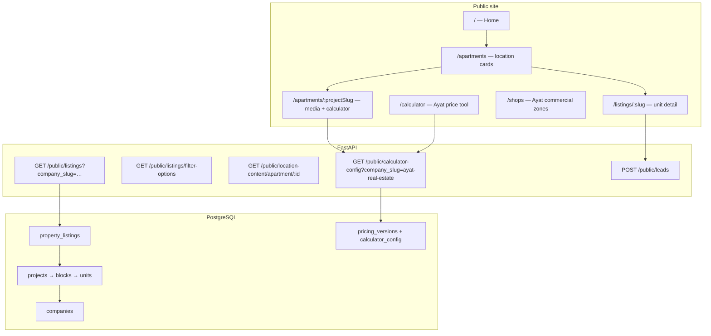

# Temer Properties — integration plan (Belay Properties)

> **Prerequisites:** [`TEMER_PROPERTIES_RESEARCH.md`](TEMER_PROPERTIES_RESEARCH.md) and [`backend/data/temer_scraped.json`](../backend/data/temer_scraped.json)  
> **Related:** [`AYAT_DATA_ENTRY.md`](AYAT_DATA_ENTRY.md), [`BELAY_PROPERTIES_IMPLEMENTATION_PLAN.md`](BELAY_PROPERTIES_IMPLEMENTATION_PLAN.md)

---

## Simple path (recommended)

**Goal:** Temer homes show on the same site as Ayat. No second calculator, no big redesign.

| Step | What | Who |
|------|------|-----|
| 1 | Add Temer as a second **company** in the database + a handful of **listings** (start with Sarbet City Plus + 1–2 other projects) | Seed script / admin |
| 2 | Home page: small **“Also from Temer Properties”** block + link to filtered apartments | Frontend |
| 3 | `/apartments`: same page as now — cards already show **developer name**; optional filter **Ayat \| Temer** | Frontend (light) |
| 4 | Listing page: photo, text, **contact Belay** (form / WhatsApp). **No price calculator** for Temer | Already mostly works |

**Skip for now:** Temer pricing engine, `/shops` for Temer, 32 listings at once, location CMS videos, re-scrape automation.

**One rule:** Temer projects in “Ayat” on their site are still **Temer** on Belay (badge says Temer Properties).

*Everything below is optional detail if you want to go deeper later.*

---

## 1. How the site works today

Belay Properties is a **comparison and sales layer**: visitors browse verified inventory from partner developers. The platform is **multi-company in the database**, but the **public UI is still Ayat-first**.



### 1.1 Data model (already supports Temer)

| Layer | Tables / concepts | Company-specific? |
|-------|-------------------|-------------------|
| Developer | `companies`, `company_contacts` | Yes |
| Inventory | `projects` → `blocks` → `property_units` → `property_listings` | Yes (`company_id` on project) |
| Unit taxonomy | `unit_types` (e.g. Ayat `SFCA`, `SFCR`) | Per company |
| Pricing | `pricing_versions`, `price_table_rows`, `calculator_config` | Per company (live config API) |
| Marketing | `location_content`, `home_page_cards` | Mostly global / per `location_id` |
| Leads | `leads` linked to listing | Listing → company inferred |

**Public listing rules** (`public_listings.py`):

- Only `is_public` listings, units `available`, `companies.is_active`.
- Filters: `city`, `area`, `bedrooms`, `unit_type_code`, **`company_slug`**, `project_slug`.
- **`filter-options`** builds developer dropdown from **live inventory** (no hardcoded list in API).

### 1.2 Public routes (frontend)

| Route | Purpose today |
|-------|----------------|
| `/` | Hero + **PartnerAyatSection** + category cards → `/apartments` or `/shops` |
| `/apartments` | All public listings grouped by **project** (`ProjectLocationCard` shows `company_name`) |
| `/apartments/:projectSlug` | Location CMS + **embedded AyatPriceCalculator** (Ayat-oriented copy) |
| `/listings/:slug` | Detail; **Ayat** listings get calculator preset; others use `price-preview` API |
| `/shops` | Ayat commercial zones (calculator-driven, not Temer shop inventory) |
| `/calculator` | Full-page **Ayat** calculator (`company_slug` fixed to `ayat-real-estate` in hook) |

### 1.3 Ayat-specific coupling (what we must loosen for Temer)

| Area | Current behavior | Temer impact |
|------|------------------|--------------|
| `frontend/src/content/partners.ts` | Only `AYAT_PARTNER` | Add `TEMER_PARTNER` |
| Home / nav / footer | Copy and links assume Ayat | Dual-partner messaging |
| `PartnerAyatSection` | Single partner block | Second partner or shared “Developers” section |
| `ProjectListingsPage` | Eyebrow: “Ayat apartments” | Show developer name from API |
| `AyatPriceCalculator` | Ayat projects, SFCA/SFCR, official JSON | **Not applicable** until Temer rates exist |
| `useCalculatorConfig('ayat-real-estate')` | Default company | Temer needs separate config or no calculator |
| `ListingDetailPage` | Embeds calculator when `company_slug === ayat-real-estate` | Temer: leads + “estimate on Temer site” or Phase 2 calculator |
| `ListingFilters` fallback | Only Ayat in offline fallback | Auto-fix once Temer listings exist |
| Seed | `seed_ayat_production.py` + `ayat_production.json` | New `temer_production.json` + seed script |
| Admin → Pricing | Company dropdown (multi-company ready) | Enter Temer rows when rates known |

### 1.4 What already works without backend changes

Once Temer has `companies`, `projects`, `units`, and `listings` in the DB:

- Listings appear on `/apartments` with **Temer badge** on cards.
- `GET /public/listings?company_slug=temer-properties` filters correctly.
- Developer filter in UI populates **Temer Properties** from `filter-options`.
- Listing detail, images, leads, and WhatsApp flow work like any company.
- Admin can manage inventory via existing APIs (company-scoped).

---

## 2. Product goal: represent Temer alongside Ayat

### 2.1 Principles

1. **Belay stays the broker** — “Verified listings · contact Belay” (not impersonating Temer’s site).
2. **Clear attribution** — Every card/detail shows **developer** (Ayat vs Temer).
3. **No fake pricing** — Do not show ETB totals until Temer provides official tables (scraped site rarely lists prices).
4. **Ayat ≠ Temer “Ayat area”** — Temer projects in geographic Ayat (e.g. Ayat 49, Feres Bet) are **Temer inventory**, not Ayat Share Company stock.

### 2.2 Recommended UX (MVP)

| Surface | Recommendation |
|---------|----------------|
| Home | **Two partner cards**: Ayat + Temer (mirror `PartnerAyatSection`) |
| Nav | **Developers** or separate pills: Ayat \| Temer (external site links optional) |
| `/apartments` | **All developers** by default; filter chips: All \| Ayat \| Temer |
| `/apartments?company_slug=temer-properties` | Temer-only browse (shareable) |
| Project pages | Generic “Apartments at {location}” + developer badge; calculator only if company has config |
| `/calculator` | **Phase 1:** Ayat only + short note “Temer estimates — contact us / Temer calculator”. **Phase 2:** `/calculator?developer=temer` when rates exist |
| Listing detail | Temer: photos, specs, delivery, **lead form**, hotline 6033 in copy; link to [Temer calculator](https://temerproperties.com/price-calculator/) optional |
| Shops | **Ayat-only** for now (Temer shops live under `/apartments` project pages or later `/shops` extension) |

### 2.3 Optional later UX

- `/developers` index page listing all partners.
- Temer-only construction updates (blog-style CMS or static markdown).
- Company-specific lead routing email / CRM tags (`source=temer`, `company_id`).

---

## 3. Data mapping: scrape → Belay inventory

Source: `temer_scraped.json` (32 listings, 6 areas).

### 3.1 Company record

```json
{
  "slug": "temer-properties",
  "name": "Temer Properties",
  "phone": "+251975666699",
  "website": "https://temerproperties.com/",
  "description": "Addis Ababa developer. Belay Properties lists selected Temer apartments and commercial units.",
  "is_active": true
}
```

Add `company_contacts`: hotline label `6033`, secondary phone, `info@temerproperties.com`.

### 3.2 Projects (suggested slugs)

Group listings by development — **one project per development**, multiple unit types/listings underneath.

| Temer area | Suggested `project.slug` | Listings (from scrape) |
|------------|--------------------------|-------------------------|
| Sarbet | `sarbet-city-plus` | City Plus 1/2/3 BR |
| Sarbet | `sarbet-blue-point` | Blue Point 3 BR |
| Sarbet | `sarbet-au` | Au 2/3 BR |
| Sarbet | `sarbet-seken` | Seken 3 BR |
| Aware | `aware-site` | 1 BR, 3 BR, 4 Kilo 2/3 BR |
| Ayat (Temer) | `ayat-feres-bet` | 2/3 BR |
| Ayat (Temer) | `ayat-to-center` | 3 BR |
| Ayat (Temer) | `ayat-lomiyad` | 2/3/4 BR |
| Ayat (Temer) | `achante` | 3 BR |
| Piyassa | `lycee-burat` | 1/2/3 BR |
| Piyassa | `lycee-newroad` | 2/3 BR |
| Piyassa | `lycee-seken` | 1/2/3 BR |
| Piyassa | `sumaletera` | 3 BR |
| Piyassa | `adwa-ewket` | Shops |
| Piyassa | `adwa-empire` | Shops |
| Piyassa | `arada-site` | Shops |
| Garment | `haile-garment` | 3 BR |
| Gelan | `gelan-shopping-center` | Commercial |

Use Temer **`property_id`** in listing `description` or internal admin notes for sync with their CRM.

### 3.3 Unit types (Temer — not Ayat codes)

Do **not** reuse `SFCA` / `SFCR`. Use readable codes:

- `T1BR`, `T2BR`, `T3BR`, `T4BR` (bedroom-based), or
- `APT-1BR-SARBET-CITY-PLUS` if you need uniqueness per project.

Set `category`: `residential` or `commercial` for shops/Gelan.

### 3.4 Listings

- **One public listing per marketed unit type** on Temer (32 rows), or one listing per project with “from X m²” in description if you lack per-unit numbers.
- `slug`: derive from Temer URL slug (e.g. `sarbet-city-plus-one-bedroom`).
- `area` / `city`: `Addis Ababa` + human area (`Sarbet`, `Aware`, `Ayat`, `Piyassa`, `Garment`, `Gelan`).
- Images: import from scrape `images[]` (Cloudinary upload script optional).
- `is_public: true` when ready; start with a **pilot subset** (e.g. Sarbet City Plus + Aware) if you want soft launch.

### 3.5 Pricing & calculator (Phase 2)

| Item | Ayat today | Temer |
|------|------------|--------|
| Price rows | `ayat_official_2018.json` → DB | Need Temer PDF / calculator reverse-engineer |
| Calculator config | `calculator_config` on live pricing version | New JSON; sites: Gelan, Aware-Zuhran, Sarbet Blue-Point |
| Public API | `?company_slug=temer-properties` | Same endpoint, different payload |

**MVP:** Skip published pricing; listing detail shows “Price on request — contact Belay” and optional link to Temer’s calculator.

---

## 4. Implementation phases

### Phase 0 — Decisions (you)

- [ ] **Launch scope:** all 32 listings or pilot (Sarbet + Aware)?
- [ ] **Calculator:** link-out only vs build Temer config on Belay?
- [ ] **Leads:** Belay WhatsApp only vs also surface Temer 6033?
- [ ] **Images:** scrape URLs hotlink vs upload to Cloudinary?

### Phase 1 — Data & backend (no UI theme rewrite)

| # | Task | Files / notes |
|---|------|----------------|
| 1.1 | Create `backend/data/temer_production.json` from scrape | Mirror `ayat_production.json` structure |
| 1.2 | Add `seed_temer_production.py` | Upsert company, projects, types, units, listings; idempotent |
| 1.3 | Document entry | `docs/TEMER_DATA_ENTRY.md` |
| 1.4 | Run seed locally + prod | `docker compose exec api python -m app.scripts.seed_temer_production` |
| 1.5 | Verify API | `GET /public/listings?company_slug=temer-properties` |

**Acceptance:** Temer listings visible in API; filter-options includes Temer.

### Phase 2 — Public UI: Temer alongside Ayat

| # | Task | Files / notes |
|---|------|----------------|
| 2.1 | `TEMER_PARTNER` in `partners.ts` | slug, brand, website, hotline |
| 2.2 | i18n EN/AM | `partner.temer.*`, home hero plural “partners” |
| 2.3 | `PartnerTemerSection` or `PartnerDevelopersSection` | Home: two columns or carousel |
| 2.4 | Nav / footer | Temer link; optional `company_slug` query on apartments |
| 2.5 | `ApartmentsPage` | Developer filter chips; remove Ayat-only empty CTA |
| 2.6 | `ProjectListingsPage` | Dynamic eyebrow: `{company_name}` |
| 2.7 | `ListingDetailPage` | Temer branch: no Ayat calculator; CTA + optional external calc link |
| 2.8 | `ProjectLocationCard` | Already shows `company_name` — ensure contrast for two brands |

**Acceptance:** User can browse Ayat and Temer on one site; clear badges; Temer detail does not show Ayat calculator.

### Phase 3 — Location content & media

| # | Task | Files / notes |
|---|------|----------------|
| 3.1 | Admin: location content for Temer `project.slug`s | Reuse `location_content` API |
| 3.2 | Copy from scrape / Temer site | Descriptions, delivery months, building type |
| 3.3 | Optional video embeds | YouTube from Temer marketing |

**Acceptance:** `/apartments/sarbet-city-plus` has hero text and gallery.

### Phase 4 — Pricing & calculator (when Temer provides rates)

| # | Task | Files / notes |
|---|------|----------------|
| 4.1 | `temer_calculator_config.json` or admin-entered rows | Gelan / Aware-Zuhran / Sarbet Blue-Point |
| 4.2 | Seed into `pricing_versions.calculator_config` | Admin → Pricing, company = Temer |
| 4.3 | Generalize calculator UI | `company_slug` query param; rename component when ready |
| 4.4 | Listing price-preview | Enable for Temer when `price_table_rows` exist |

**Acceptance:** `/calculator?company_slug=temer-properties` produces estimates consistent with Temer sales.

### Phase 5 — Admin & ops

| # | Task | Files / notes |
|---|------|----------------|
| 5.1 | Admin listings: filter by company | If not already on `AdminListingsPage` |
| 5.2 | Leads report: `company` column | Dashboard / export |
| 5.3 | Re-scrape job | Cron or manual `scrape_temer_properties.py` → diff alert |

---

## 5. File checklist (expected touch set)

```
backend/data/temer_production.json          # NEW
backend/app/scripts/seed_temer_production.py  # NEW
docs/TEMER_DATA_ENTRY.md                    # NEW

frontend/src/content/partners.ts            # TEMER_PARTNER
frontend/src/components/PartnerTemerSection.tsx  # NEW (or generalize Ayat section)
frontend/src/pages/HomePage.tsx
frontend/src/layout/PublicLayout.tsx
frontend/src/pages/ApartmentsPage.tsx
frontend/src/pages/ProjectListingsPage.tsx
frontend/src/pages/ListingDetailPage.tsx
frontend/src/i18n/locales/en.ts + am.ts

# Phase 4 only:
frontend/src/components/AyatPriceCalculator.tsx  # company_slug prop (exists in hook)
frontend/src/pages/AyatCalculatorPage.tsx
backend/data/temer_calculator_config.json   # when rates known
```

**No schema migration required** for Phase 1–2 if using existing tables.

---

## 6. Risks & mitigations

| Risk | Mitigation |
|------|------------|
| Confusion between Ayat Share vs Temer in Ayat area | Always show `company_name` on cards; glossary in FAQ |
| Stale scrape vs sold units | Mark unavailable in admin; periodic re-scrape |
| Wrong prices | No public price until official Temer table signed off |
| Image hotlink breakage | Upload to Cloudinary in seed |
| SEO duplicate content | Write original Belay descriptions; link to Temer for full specs |

---

## 7. Suggested MVP order of work (1–2 weeks)

1. **Day 1–2:** `temer_production.json` + seed script (pilot 8–10 listings).
2. **Day 3:** Verify API + manual QA on listing detail / leads.
3. **Day 4–5:** Frontend partners section + apartments filter + listing detail Temer branch.
4. **Day 6:** Location content for 2 flagship projects (Sarbet City Plus, Aware).
5. **Later:** Full 32 listings, images to Cloudinary, Temer calculator Phase 4.

---

## 8. Quick reference: Ayat vs Temer on Belay

| | Ayat Share Company | Temer Properties |
|---|-------------------|------------------|
| Slug | `ayat-real-estate` | `temer-properties` |
| Unit codes | SFCA, SFCR, RFCA, RFCR | T1BR, T2BR, … (new) |
| Calculator | Official Ayat/116/2018 | Not in MVP; link or Phase 4 |
| Shops | `/shops` zones | Gelan + Piyassa shops via apartment projects |
| Partner site | ayatrealestate.com | temerproperties.com |
| Research | `AYAT_DATA_ENTRY.md` | `TEMER_PROPERTIES_RESEARCH.md` |

---

## 9. Next step

Confirm **Phase 0** choices (scope, calculator, leads, images). Then implement **Phase 1** (seed data) and **Phase 2** (UI) in that order.
